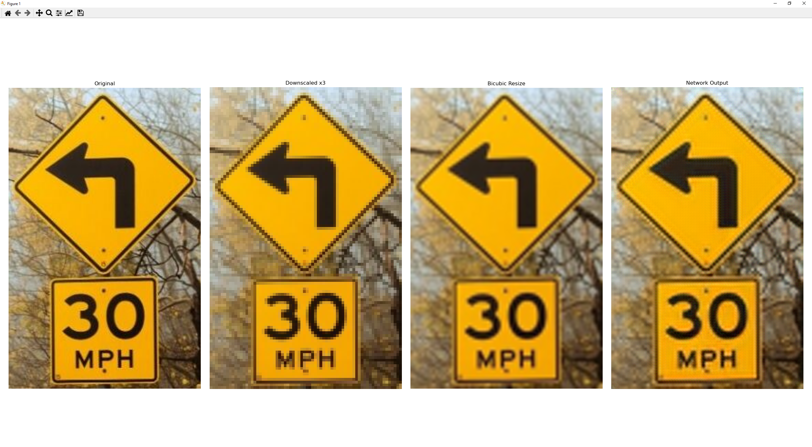

# ESPCN — Efficient Sub-Pixel Convolutional Neural Network for Image Super-Resolution

This project implements the **ESPCN (Efficient Sub-Pixel Convolutional Neural Network)** — a lightweight deep learning model that enhances image resolution.  

---

## Dependencies

- tensorflow
- numpy
- opencv-python
- matplotlib

## How to train

Run the training script:

```
python train.py
```

## How to run demo

Run the demo script:

```
python demo.py <image_path>
```

## Result example


